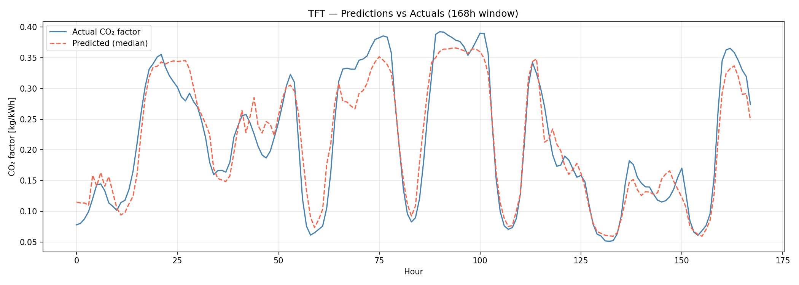

# CO₂ Emission Factor Forecasting (Netherlands)

7-day hourly forecasts of the Dutch grid CO₂ emission factor (kg CO₂ / kWh) using a Temporal Fusion Transformer with weather forecasts as known-future covariates. NHiTS and seasonal naive (t-24) are included as baselines.

The CO₂ emission factor measures the carbon intensity of grid electricity at a given hour. It rises when the grid leans on gas and coal, falls when wind and solar generation are high. A reliable 168h forecast helps shift flexible loads (EV charging, heat pumps, industrial processes) toward cleaner hours.

## Why TFT

- **Known-future inputs**: weather forecast and time features are deterministic for the horizon. TFT uses them in the decoder; an LSTM cannot do this natively.
- **Quantile output**: predicts q10, q50, q90, giving an 80% interval per hour. Useful for downstream load-shifting decisions.
- **Strong baseline included**: NHiTS does not use future covariates, so the gap between TFT and NHiTS is roughly the value added by the weather forecast.

## What's in here

- Modular pipeline: data loading, splits, feature engineering, datasets, models, training, evaluation, and inference each in their own module.
- Config-driven: all hyperparameters and paths in `config.yaml`, no hardcoded values in code.
- Honest evaluation: chronological train/val/test split with explicit `min_prediction_idx` to prevent leakage; seasonal naive (t-24) baseline; per-horizon MAE breakdown (1-24h / 25-72h / 73-168h); top-10 worst forecast windows analysis.
- Sanity tests covering the most easy-failing parts: time feature determinism, chronological split correctness, naive baseline on a known-periodic signal.

## Results

Test set: 2024-10-01 to 2025-12-31 (~15 months unseen).

| Model                  | MAE (kg/kWh) | RMSE (kg/kWh) |  MAPE (%)| WAPE (%)|
|------------------------|--------------|---------------|----------|---------|
| Seasonal naive (t-24)  |    0.0668    |     0.0920    |  41.0973 |  30.43  |
| NHiTS                  |    0.0565    |     0.0703    |  44.2561 |  25.72  |
| TFT                    |    0.0385    |     0.0483    |  31.1261 |  17.54  |

Note: MAPE is sensitive to small target values — the CO₂ factor approaches zero in hours with high wind/solar generation. MAE and RMSE are more reliable for ranking models on this data.

Per-horizon MAE (TFT):

| Horizon  |   MAE   |
|----------|---------|
| 1-24h    |  0.0385 |
| 25-72h   |  0.0382 |
| 73-168h  |  0.0387 |

TFT achieves the best performance across all metrics, reducing MAE by ~42% compared to the seasonal naive baseline and by ~32% compared to NHiTS.

Plots saved to `artifacts/predictions/` after evaluation.

## Example forecast (168h window)

<p align="center">
  
</p>

TFT captures both daily seasonality and sharp changes in CO₂ intensity.


## Project structure

```

co2_forecast_nl/
├── config.yaml         # all paths and hyperparameters
├── requirements.txt
├── src/
    └── co2_forecast/
        ├── __init__.py
│       ├── data.py         # load_and_prepare, make_splits, build_datasets, add_time_features
│       ├── models.py       # build_tft, build_nhits (baseline)
│       ├── train.py        # CLI: train one model
│       ├── evaluate.py     # CLI: metrics, naive baseline, plots
│       └── forecast.py     # CLI: 168h forecast with weather input
├── tests/
│   └── test_basic.py
└── data/               # CSVs 
```

## Quick start

```bash
git clone https://github.com/kyuberis/co2_forecast_nl.git
cd co2_forecast_nl

python -m venv .venv
source .venv/bin/activate         # Windows: .venv\Scripts\Activate.ps1

```

Files `master_dataset.csv` and `openmeteo_forecast_7days.csv` are in `data/`. 

Then:

```bash
# 1. Install package (editable mode)
pip install -e .

# 2. Run basic tests
pytest -v              

# 3. Train models
python -m co2_forecast.train --config config.yaml --model tft
python -m co2_forecast.train --config config.yaml --model nhits

# 4. Evaluate models
python -m co2_forecast.evaluate --config config.yaml

# 5. Generate forecast
python -m co2_forecast.forecast --config config.yaml


```

For a CPU smoke-test before a real GPU run, edit `config.yaml`: set `max_epochs: 2`, `batch_size: 16`, `tft_hidden_size: 16`, `accelerator: cpu`. Once the pipeline runs end-to-end, use proper parameters and train on GPU.

## Data

- **Target**: `co2_emissionfactor`, hourly, Dutch grid.
- **Past covariates**: per-source generation and capacity (solar, wind, offwind, biomass, waste, gas, coal, nuclear) plus missingness flags from upstream imputation.
- **Future covariates**: cyclical time features (hour, day of week, day of year, month), `is_daylight`, and Open-Meteo weather forecast variables.

All features are constructed using only information available at or before the prediction time to avoid leakage.

